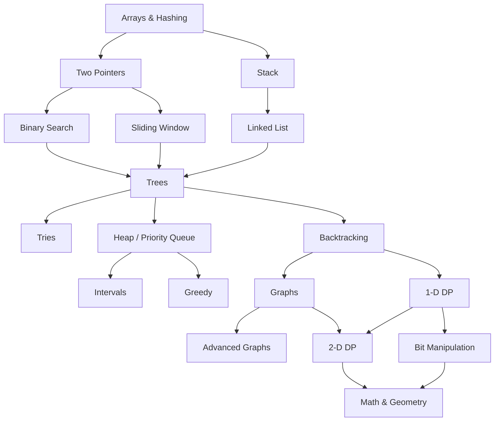

# Main 2026 Repository
# 🧠 Dev Growth Repo

A Mike repository dedicated to improving programming skills through hands-on practice.

## 📌 Goals

- Strengthen understanding of **Data Structures & Algorithms**
- Explore and implement **Design Patterns**
- Deep-dive into various **Programming Topics & Concepts**

## 🛠 Languages

> *(C++, C#, and Python)*

## 🚀 Purpose

This is a self-improvement space — not production code. Expect experiments, notes, and iterative solutions as I learn and grow as a developer.

## Roadmap

---

> *"The expert in anything was once a beginner."*
